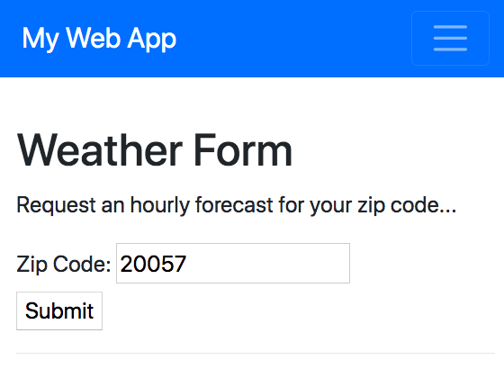

# "Web App" Exercise

> Prerequisites:
>   + [Software Products and Services](/units/unit-9.md)
>   + [The Open Weather API](https://home.openweathermap.org/api_keys) (sign up and obtain an API Key)
>   + [The `flask` Package](/notes/python/packages/flask.md)
>   + [Heroku](/notes/clis/heroku.md) (sign up for a account and install the Heroku CLI)
>   + [Web Service Exercise](/exercises/web-service/README.md), especially the deployment process

> FYI: this web application involves some basic HTML code. To gain familiarity with HTML and the Twitter Bootstrap front-end framework, see these resources:
>   + https://www.w3schools.com/html/html_basic.asp
>   + https://www.w3schools.com/html/html_forms.asp
>   + https://www.w3schools.com/html/html_tables.asp
>   + https://getbootstrap.com/docs/4.0/components/navbar/
>   + https://getbootstrap.com/docs/4.0/components/alerts/

## Learning Objectives

  + Practice leveraging third-party APIs and Python packages.
  + Practice security and privacy best practices by using a "dotenv" approach in conjunction with a ".gitignore" file.
  + Gain high-level exposure to basic HTML.
  + Learn how to use the Flask package to create a basic web application in Python.
  + Learn how to "deploy" a Python web application to a user-facing "production" environment, namely an application server hosted by Heroku, and configure the server to host the application publicly over the Internet.

## Instructions

So, you've setup a background web service to send you an email every day. But what if you wanted your information on-demand at the click of a button, without waiting for the next daily email? And what if you wanted to allow other people to register for your service? Let's build a web application interface into your application's functionality!



Follow along in class as the professor guides you through the process of building a web application from scratch.

If you'd like to work ahead or asynchronously, you can reference this [Draft Pull Request in the Daily Briefings Repo](https://github.com/prof-rossetti/daily-briefings-py/pull/4) which includes a [step-by-step commit history](https://github.com/prof-rossetti/daily-briefings-py/pull/4/commits) and [comprehensive file diffs](https://github.com/prof-rossetti/daily-briefings-py/pull/4/files).


### Setup

To use the Flask package, you'll need to add `Flask` to the "requirements.txt" file and re-install packages:

```sh
pip install -r requirements.txt
```

### Running Locally

Depending on the way a Flask app is organized, the run command will differ, but based on the provided organizational structure (with the `create_app()` function in the "web_app/\_\_init__.py" file), the following command should run web application locally so you can view it in a browser at localhost:5000:

```sh
# Mac:
FLASK_APP=web_app flask run

# Windows:
set FLASK_APP=web_app # first time, to set the env var
flask run # subsequent times
```

### Deploying to Production

After demonstrating the ability to successfully run the web app locally, repeat the process that you followed when [deploying a web service](/exercises/web-service/deploying.md) to upload the source code onto a remote server and configure environment variables, etc.

There are no scripts to be scheduled, so skip that part. Instead, you'll need to create a special file called the "Procfile" in the repo's root directory to instruct the Heroku server which command to invoke in order to run the app:

```sh
web: gunicorn "web_app:create_app()"
```

> NOTE: since we're instructing the server to use the `gunicorn` package (Heroku's preferred tool) to run the web app on production, we'll also need to add that package to the "requirements.txt" file so it will be installed on the server during the deployment process.

Save the "Procfile" and "requirements.txt" files, and make a commit before re-attempting to deploy your app to the server.

View the server logs and troubleshoot as necessary until you're able to see the weather forecast in the browser. Nice!

## Evaluation

If you'd like to submit this exercise for evaluation, submit links to both your GitHub repo and your production app via the designated form.
